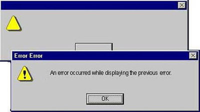
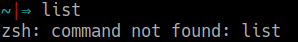
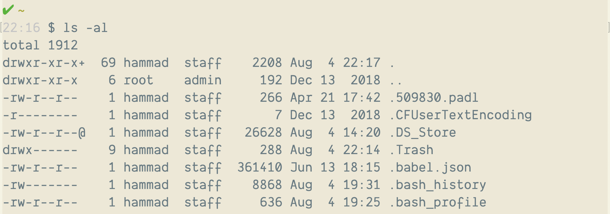

# The CLI (Command Line Interface)

## Learning Objectives

- Define and explain the strengths and weaknesses of GUIs and CLIs
- Learn how to access the terminal and break down its components
- Describe the file system and how it relates to the CLI
- Introduce common commands and list unsafe ones
- Learn how to find more information on using commands
- Introduce Bash and how to customize the command line

## Framing (10 minutes / 0:10)

The majority of our interactions with computers is through a graphical user
interface, or a GUI. A GUI is a great tool, it adds a level of user experience
that allowed computers to become more popular and mainstream.

While the GUI is perfect for the average computer user, there are drawbacks for
power users:

Some of those hindrances include:

- GUI's can be slow
- GUI's can be resource intensive, causing the gui to freeze which means you
  could lose data or it can cause other applications to stop working
- GUI's lack flexibility, you can only use a gui for it’s intended purpose
- GUI's require manual effort, pointing and clicking, require that you take your
  hands off the keyboard

You all are on your way to becoming full-stack developers, on your journey to
that point you will need to make the most of your time, effort and to avoid
common issues that come with using a GUI. So today we will be learning the
command line.

### What is the Command Line Interface or CLI

A text-based way of interacting with your computer, that gives you more
abilities than a GUI has. Except with a higher learning curve.

The CLI works by typing commands (running programs) into a terminal and the
computer executes those commands or gives you a fairly descriptive error
regarding why it did not work.

> The [unix philosophy](https://en.wikipedia.org/wiki/Unix_philosophy) says
> "make each program do one thing well". This concept is not unix specific, it
> carries itself in to other aspects of programming as well.

You can create files, you can move between directories, you can connect to
remote machines, you can pull code from a repository, you can scan ports, you
can send http requests.

Similar to how people make code and share it for things like Bootstrap, or Ruby
on Rails, or any other open source technology, software engineers create command
line tools that make completing task on the command line easier and then share
them with other developers.

Then developers like ourselves can install these tools and use them. We will do
that in a moment.

<!-- #### Turn & Talk (10 minutes / 0:20)

Given the information I just gave you regarding the CLI and what you learned
from completing the pre-work. I want you to discuss for 5 minutes the following
with your classmates in your row.

- How is the CLI different from the GUI?
- What do you like / dislike about using it?
- Compared to a GUI, in what ways might using the CLI be better or worse for
  developers? -->

## Benefits of the CLI (10 minutes / 0:30)

**Power/Speed.** Most tasks can be completed faster with the cli. Features like
tab completion, command history (hitting the up arrow in your terminal), piping
contribute to this.

**Precision.** Each command does only one thing and we can read them and
understand what they do before we run them.

**Repeatability / Scriptability.** These commands can be saved, reused by
others. What you did during Installfest was run a script that we shared with
you!

**Tools.** There are a lot of open source tools that you can use on the cli, you
can install them with cli package managers like Advanced Packaging Tool (apt) on
linux or homebrew on macOS. Because each tool does one specific thing, it is
possible to chain multiple tools together to automate processes.

**Debugging.** The errors are better, the errors that you get from a GUI can be
unhelpful while cli errors are generally more thought out and descriptive.

Not helpful:




Helpful:



How do people feel about their level of understanding regarding what the CLI is?

Not using it, just their understanding of what it is, it’s benefits and it’s
downsides.

## CLI Basics (15 minutes / 0:45)

### The Terminal and the Shell

How do we get at this text-based interface from our GUI desktop? We run what's
called a terminal application (also often referred to as a terminal emulator).
The default on OSX is `Terminal.app`. When you open a new Terminal window, the
Terminal app will call a program called a **shell**.

A shell is a program that takes commands, passes them to the operating system
and returns any output or errors. The default shell used by terminal is called
**Bash**. There are other shells but all operate very similarly.

Let's fire up our terminals and get exploring!

### Getting Oriented

First, open Terminal by clicking the icon on your dock, finding the application
in Applications > Utilities > Terminal, or using Spotlight (**&#x2318; + SPC**)

You should see something like the following prompt:


The prompt is the shell asking for input; when you see `$ <something>` in
documentation, it generally means, input this command into a shell.

If you have a terminal open but do not see a prompt, that means that the shell
is not ready to receive input.

Typing a random string of characters and hitting enter will produce a message
`-bash: <your-random-string>: command not found`


> What is a command?

A command is a program. Some come built into the shell and provide the basics
for interacting with the operating system and some are written by programmers
(like you!) to provide further functionality.

> What are some basic commands that you've covered previously?

## File System (45 minutes / 1:30)

In the next section of this lesson, we're going to work through a couple of
commands that you'll end up using almost every day as a developer. The commands
can be divided into two kinds of tasks: Navigating around the file system and
working with files and directories.

### Navigating the File System

The first set of commands we'll cover are for navigating: getting from one
directory to another.

You may have seen these commands before (maybe in the prework):

| command | definition                 |
| ------- | -------------------------- |
| `pwd`   | print working directory    |
| `ls`    | list files and directories |
| `cd`    | change directory           |

How do these relate to navigating?

If we're inside the terminal and we want to travel through our file system to a
specific directory (i.e. `traverse`), we first need to know where we are. That's
what we use `pwd` for: printing the directory we're in currently.

Once we know where we are, it makes sense to figure out where we can go from
here. We use `ls` for that: listing all the files we can work with directly and
the directories we can move to.

To move from our current directory to another directory, we use the `cd`
command. `cd` moves us from our current directory to another directory that we
supply a path to.

> When we open a terminal window for the first time, what directory are we in?

You can think of a path as being similar to an address. There are two types of
paths: _absolute_ and _relative_.

#### Absolute vs Relative

A _relative_ path is similar to giving someone directions to a destination from
their current location. Where is General Assembly? Two blocks up 15th street
from where you are now.

An example of an _absolute_ path to General Assembly could be 1133 15th St NW,
8th Floor, Washington, DC 20005 or a longitude and latitude(38.9048728,
-77.0340283).

An absolute path is comparable to giving someone the direct location from a
universally known starting point. On the command line that known starting point
is the root directory.

```
/
```

This is not the same as the directory that we start in when we open the terminal
for the first time. That's called `home` and looks something like this:

```bash
# mac
/Users/seistudent

# ubuntu linux
/home/seistudent

# replace seistudent with your computer username
```

Note the `/` before `home` and before `Users`. That is the root. It's the top of
the navigable filesystem, we can't go above it, but we can go to it.

Let's navigate/traverse our directory so we have a better understanding of these
concepts.

Here is how that translates into actual commands you could run to navigate to
your `Documents/` directory from your `home` directory:

**Relative Path:**

```sh
cd ./Documents/
cd Documents
# these are equivalent
```

**Absolute Path:**

```sh
cd /Users/seistudent/Documents
```

In the _relative_ path, the leading `./` stands for: _from the current
directory_. You can also omit the `./` and it means the same thing, but it's a
good idea to include it because it's more explicit.

In the _absolute_ path, the leading `/` means from the root of the file system.
Then we add the `Users/` directory and then the `seistudent/` directory, and
`Documents` is inside of there.

The `seistudent` directory has a special name too: the _home_ directory.

A shortcut to this directory is represented by the tilde character `~`

If you type `cd ~` it will take you to the home directory, no matter where you
are

If you see `~` in a file path, you can imagine it as a substitute for
`/Users/seistudent`, which is helpful to save a lot of typing.

#### Going up

If you do an `ls -la` you will notice several dots at the top of the list of
file contents.



Can you guess what these mean?

Try typing `cd ..` and seeing what happens.

- What if you want to go up more than one level at a time, without repeating the
  same command again?

#### You do: Go Explore (5 min)

Using the commands you've learned, go explore your file system for a few
minutes. When you open a new terminal window, where in the file system are you?
What do you see? Compare that to opening a new window in `Finder`.

#### [You Do: Directory Tree](https://git.generalassemb.ly/pages/dc-wdi-fundamentals/directory-tree/) (15 minutes)

> 10 minute exercise, 5 minute review

- Open the link above in a new tab.

Follow the directions on the page. Use your terminal to navigate the directories
or check your answers.

## Break (10 min)

### Working with Files and Directories

Now that we can navigate the file system, it's time to chart our own paths (pun
intended).

The commands we'll be covering next are:

| Command | Description              |
| ------- | ------------------------ |
| `mkdir` | make a new directory     |
| `rmdir` | remove a directory       |
| `touch` | create a new file        |
| `rm`    | remove a file            |
| `mv`    | move a file or directory |
| `cp`    | copy a file or directory |

### Command Syntax

Commands generally consist of three parts

1. Command
2. Options
3. Arguments

The **Command** is the first word you type into the CLI (e.g. `ls`, `cd`, or
`touch`). Think of it as the "verb" which indicates what we want to do.

Next come the **Options**, sometimes called flags or switches.

- Sometimes you won't be using any options. Other times you may use several
- By convention, options will start with a dash or two; one if the option is a
  single letter and two for the "long" name
- Sometimes an option takes an argument. In these cases, the argument comes
  right after the option

Finally come the **Arguments**. These are "targets", or what you want to do the
action to. These could be file names, URLs, etc.

The commands entered into the CLI are often in one of the following forms..

- `doSomething --how toFiles`
- `doSomething -h toFiles`
- `doSomething --how sourceFile destinationFile`

Where **doSomething** is, in effect, a verb or command, **how** an adverb (for
example, should the command be executed "verbosely" or "quietly")
and **toFiles** an object or objects (typically one or more files or folders) on
which the command should act.

So, using a real example:

```bash
cd /Users/hammad # takes me to the home directory
cd ~ #takes me to the home directory
mkdir sei # makes a folder called sei in the current directory
mkdir /Users/hammad/sei/2019 # makes a folder called 2019 in my ~/sei directory
touch index.js # makes a file called index.js in the current directory
```

Many commands have a short and a long version of the same options.

The short form has a single `-` and a single letter, upper or lowercase
depending on the option.

The long form has two `--` and usually a whole word, or several words separated
by a dash.

```bash
ls -h
ls --help
# -h and --help are equivalent
```

In most cases there's an equivalent short and long form of each option. But not
always.

```bash
rm -r
rm -R
rm --recursive
# all 3 are equivalent

rm --no-preserve-root
# no short form equivalent
```

You can combine multiple options by just jamming them together without a dash

```bash
rm -rf # same as rm --recursive --force

tar -xvzf # same as tar --extract --verbose --gzip --file or tar -x -v -z -f
```
Your life might one day depend on your knowledge of the command-line.

[](https://m.xkcd.com/1168/)

### Output and Side Effects

Some commands have **output**, which is displayed on the screen for us to see.
Examples of commands that have output are...

- `pwd`
- `ls`
- `brew install tree`.

Other commands' primary purpose is to execute some **side-effect**, or in other
words, to make some change that isn't necessarily printed in the Terminal after
hitting enter.

Often times, a command whose main job is a side effect may not provide any
output if it succeeds. If there is an error it will provide output, so no news
is good news.

> What's an example of this we've already seen?

Another example would be `touch`. This command creates a file in an indicated
location. We do not, however, get a confirmation it did this immediately after
hitting enter.

Some commands may provide both an output and side effects.

#### You do: Create SEI Environment (5 minutes)

To get your hands dirty, use the commands above to build out the following
folders and files. This will be where you store all your work from SEI.

```sh
sei
  ├── homework
  ├── labs
  ├── lessons
  │   └── cli_intro.md
  ├── projects
  └── tmp
```

**Pro Tip:** Use brackets to substitute paths together. Lets say you want to
create a markdown file (extension `.md`) for a couple of lessons. One way to do
this would be to run the commands one-by-one:

```sh
touch lessons/cli_intro.md
touch lessons/git_intro.md
touch lessons/html.md
touch lessons/css.md
```

That would absolutely work, but you could make do it in one command:

```sh
touch lessons/cli_intro.md lessons/git_intro.md lessons/html.md lessons/css.md
```

That would also work, but we can make it a more succinct command by using
substitution:

```sh
touch lessons/{cli_intro,git_intro,html,css}.md
```

The above command will create the same set of files, but in one short command.
It also works with directories! The list of file or directories must be
separated by commas with _no spaces_.

### Exercise: Command-Option-Argument patterns

Not all commands follow this pattern, but many do.

Let's take a look at something we did for installfest.

```
$ brew install tree
```

When we type this command and hit enter, we're saying, "Computer, we're about to
do something with homebrew. The thing were going to do is install something.
What we want to install is `tree`.

> Together, using the information that we just went over, let's focus on
> identifying the command, the option/flag and the target/argument for the next
> 5 command line items.

- `$ touch index.html`
- `$ ls -la`
- `$ cp index.html index2.html`
- `$ brew install git`
- `$ mkdir -p lessons/tmp`

## Getting Help

There are three general ways to get help with a command.

- Add `--help` or `-h` to the end of the command (e.g., `brew --help`).
- Use the manual or `man` - tool (e.g., `man brew`). For a really fun time look
  up the manual for man (`man man`).
- Google!

> The `man` command will display the man pages using a program `less`. Use the
> arrow keys or mouse to navigate. Type `q` to quit. Use `/` to search and `n`
> and `p` to go to the next or previous search result

## Unsafe Commands

### `sudo`

`sudo` -- or "super user do" -- runs the command that follows as the super user
(i.e., 'root' or 'admin'). That means your computer will not prevent you from
running the command and may not even confirm if this is what you actually want
to do. This is of particular concern when the command may have destructive
effects.

> Generally, you shouldn't need to run commands with `sudo` in this course. If
> you're not sure, ask an instructor.

### `rm`

`rm` -- or "remove" -- deletes files with no confirmation. There is no `trash`
to recover removed files from. So use `rm` with caution.

You should especially use `rm -rf` with caution.

> Based on your knowledge of flags, what does `rm -rf` do?

## Common Command Teachbacks (25 minutes)

> 15 minutes preparation. 10 minutes review.

Form groups of 3 and spend 10 minutes researching and preparing a short (60
second) demo of your command. Focus on...

- What it does.
- Common uses.
- Common flags or arguments.
- Any "gotchas" (i.e., things we should be aware of when using this command)?

**Tip:** use the `man` pages!

[Linux Command](http://linuxcommand.org/) is a wonderful introduction to the
command line. Macs are Unix systems and so very similar to Linux. Almost
everything (everything I've found so far)

### Commands

1. `echo`
1. `cat`
1. `pipe or |`
1. `grep`
1. `find`
1. `less`
1. `chown` and `chmod`
1. `cal`
1. `vimtutor`

## Keyboard Shortcuts (5 minutes)

The next three points are handy shortcuts that prevent you from having to
backspace a bunch to erase the previous command.

### `CTRL + C`

Cancel whatever you were typing before, or exit the currently running program.
Abort!

### The `up` and `down` arrows

Cycle through previous commands

### `Tab` completion

When typing a command that has a file or path as an argument, like `cd`, type
only the first few letters and hit the TAB key.

## More Terminal Keyboard shortcuts

In the long term, reduce your reliance on the mouse. More Bash keyboard
shortcuts:

`COMMAND + K` Clear the Terminal window

- can also use `CTRL + L` or the command `$ clear` as well

`OPTION + <arrow>` Move cursor by word

`CTRL + A` Go to beginning of line

`CTRL + E` Go to end of line

`CTRL + K` Kill line to end

`CTRL + U` Kill line to beginning

`CTRL + Y` Paste whatever was killed using Ctrl+K or Ctrl+U

_Nifty Navigation Command:_

`$ cd -` toggle previous directory

There are also video tutorials made by GA
[here](https://www.youtube.com/playlist?list=PLdnONIhPScSToZztXRHyKZTQEsE30luMx)

## Closing (15 minutes / 2:30)

The commands we've covered in this lesson will probably account for 80% of your
CLI usage. On the one hand, that means that learning them well and getting
comfortable is really important; on the other hand, it's not a big universe of
commands to learn and memorize.

Regardless of how much experience with the command line you have coming in to
this class, your next step should be to get really comfortable with it - we're
going to spend a lot of time in the command line over the next 12 weeks. That
can mean practicing these commands more, almost like you would practice scales
from music or drills from sports. That can also mean learning more about what
else is capable with these commands.

## Additional Practice / Bonus Material

- [Command Line Fu](https://git.generalassemb.ly/dc-wdi-fundamentals/command-line-fu)
- [Kitchen Organizer](https://git.generalassemb.ly/dc-wdi-fundamentals/kitchen-organizer)
- [Learn You Bash](https://github.com/denysdovhan/learnyoubash)
- [Command Line Power User](https://commandlinepoweruser.com/)
- [Awesome Bash](https://github.com/awesome-lists/awesome-bash)

## Bash Profile Aliases (Bonus Content)

You may have noticed during Installfest that we messed with this file:
`~/.bash_profile`.

<details>
  <summary> <b>Q:</b> Based on the path, where is this file located?</summary>
  In the home directory (i.e., Users/your-name-here).
</details>

Essentially, we changed the `~/.bash_profile` to make your prompt into a better
one!

There will be commands you will find yourself doing frequently. It might become
a pain to type out these commands in full all the time. It would be really nice
if we could shorten some of these commands... enter aliasing. Aliasing is really
quite simple!

Let's open our `~/.bash_profile` in atom and type in the following...

```
alias greeting="echo 'hello world'"
alias gs='git status'
alias sbx='cd ~/sei/tmp'
```

We can also design functions in bash to allow for arguments and options...

```sh
cdls () {
cd "$@" && ls;
}
```

> At this point you may be wondering what exactly "bash" is. Bash is a language
> we can use to interact with our computer via the shell (via Terminal or some
> other text-based interface).

### Make An Alias

Take the next five minutes to create your own alias and test it. If possible,
alias something you think you'll find yourself doing frequently!

- **BONUS:** Write a command to list only files beginning with your first name.
  Label the parts of the command.

## Own your terminal

1. [Color your prompt](http://www.cyberciti.biz/faq/bash-shell-change-the-color-of-my-shell-prompt-under-linux-or-unix/)

- It will be WAY easier to read

2. [Choose a theme](http://apple.stackexchange.com/a/92769)

- Pick something you like to look at

## [iTerm2](https://www.iterm2.com/features.html)

Some instructors use iTerm2 as a terminal replacement.

Our favorite features include:

- A better, more readable font
- Hotkey support (full screen and tabs)
- Unlimited Scroll Back history

## Feeling Adventurous?

Bash isn't the only option. Check out zsh
(http://code.joejag.com/2014/why-zsh.html) or fish (http://fishshell.com/)

<!-- ADD CHECKS FOR understanding
MAKE IT MORE RELATABLE
MOVE BONUS/HOMEWORK CONTENT -->

## Go figure some stuff out

Getting comfortable in the command line takes practice. Once you do get
comfortable, you'll find it possible to be extremely productive by just adding a
couple of commands together.

The installfest script is a perfect example - your instructors wrote a single
shell script that you can run to totally set up your computers for SEI. Ask your
instructors about other shell scripts they wrote at previous jobs.

For the remainder of class, here are some things you can go try to figure out
how to do to get more comfortable with the command line:

- **Review the commands we've covered in more depth.** Go through each and
  review the help and/or `man` page for each command. Type `man <some_command`
  (i.e. `man ls`) to view the man page. Use your arrow keys (up and down) to
  navigate through the man pages and `q` to quit.
- **Practice each command.** Over time, these common commands will become part
  of your muscle memory. Get there sooner by practicing. Navigate to your
  `tmp/` directory and create a `cli-practice/` directory. `cd` into your
  new directory and practice the above commands 20 times each.
- **Customize your command line.** The sky is the limit here! You can change the
  font, the theme (colors), add emojis to your prompt, use a different terminal
  (many of your instructors use iTerm) or even use a different shell (Bash is
  the default shell, some of your instructors use
  [zsh](http://code.joejag.com/2014/why-zsh.html).
- **Create Bash profile aliases.** You can alias common commands in bash. One
  common alias you'll see a lot is an `ll` command that will perform an `ls -a`
  (list all files). See if you can figure out how to create that alias (google
  is your friend). Another possible alias you could make is `trash`, a command
  that will move a file or folder to the system Trash bin. What other aliases
  could you make?
- **Review some more advanced commands.** Look up `grep`, `less`, `cal`, and
  `vim`. View the `man` pages or google them!
- **Learn some custom, advanced commands.** [`Z`](https://github.com/rupa/z) is
  a command line tool for quickly navigating and traversing the file system. See
  if you can figure out how to install and use it.
  [This may be helpful!](https://commandlinepoweruser.com/).

## Sample Quiz Questions

- Why would a developer prefer the command line over a GUI?
- Where can we find help for shell commands?
- Describe 4 bash commands for managing folders and files.
- Describe 2 unsafe commands.
- You are currently in the "code" folder in the below file tree. How would you
  get to the folder that contains "beach.png" using the command line?

```sh
home
├── documents
│   └── code
├── photos
│   ├── headshot.jpg
│   └── summer_vacation_2014
│       └── beach.png
└── videos
```
