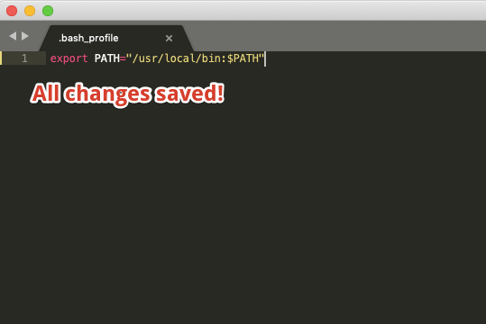

[](https://generalassemb.ly/education/web-development-immersive)

# Installfest

## What is Installfest?

Here at General Assembly, we use Installfest to install a group of applications
which we consider essential for any software developer to have. We use these
applications regularly in our classes, and it's essential for all of our
students to have them.


# Instructions 🚀

<br>

## Install WSL

[https://docs.microsoft.com/en-us/windows/wsl/install](https://docs.microsoft.com/en-us/windows/wsl/install)

<br>

## Download Git and Git Bash (PC)

_**Only if you can't install WSL!**_

[https://gitforwindows.org/](https://gitforwindows.org/)

<br>

## Open Terminal

1. Open Spotlight by clicking the little magnifying glass in the top-right
   corner of your screen, or hitting `CMD + Space`.

2. Type "Terminal" into the Spotlight text input and select the Terminal app. A
   new Terminal window should pop up.
   
<br>

## Switch to bash

_Run:_

```sh
# Remember: the "$" is the start of the Terminal prompt!

$ chsh -s /bin/bash
```

### Confirm bash

Close the Terminal completely (`CMD + Q`), then open it again.

<br>

## Create .bash_profile

_Run:_

```sh
$ touch ~/.bash_profile
```

### Confirm .bash_profile

```sh
$ source ~/.bash_profile

# Example Output

# Nothing! if you do not get any errors that means the .zshrc is in good shape.
```

... or open up a new Terminal tab with `Command` + `T`. This will automatically reload `~/.bash_profile`.


<br>

## Install Xcode

_Run:_

```sh
$ xcode-select --install
```

### Confirm Xcode

```sh
$ xcode-select --version

# Example Output

xcode-select version 2373.
```

<br>


## Install Homebrew

1. Check to see if you have Homebrew installed.

   _Run:_

   ```sh
   $ brew --version

   # Example Output – Homebrew installed

   Homebrew 3.0.2
   Homebrew/homebrew-core (git revision 4de031; last commit 2021-02-22)
   Homebrew/homebrew-cask (git revision 7cf55; last commit 2021-02-22)

   # Example Output – Homebrew not installed

   -bash: brew: command not found
   ```

2. If Homebrew is installed, update it.

   _Run:_

   ```sh
   $ brew update; brew upgrade; brew cleanup; brew doctor
   ```

   If not, [install Homebrew](https://brew.sh/).

   _Run:_

   ```sh
   $ /usr/bin/ruby -e "$(curl -fsSL https://raw.githubusercontent.com/Homebrew/install/master/install)"
   ```

3. Confirm Homebrew

	```sh
	$ brew --version
	
	# Example Output
	
	Homebrew 3.0.2
   Homebrew/homebrew-core (git revision 4de031; last commit 2021-02-22)
	Homebrew/homebrew-cask (git revision 7cf55; last commit 2021-02-22)
	```

<br>

## (Re)install Git

1. See initial version of git installed on the system.

   _Run:_

   ```sh
   $ git --version

   # Example Output

   git version 2.20.1 (Apple Git-122)
   ```

2. Install latest version of git.

   _Run:_

   ```sh
   $ brew install git
   ```

3. Completely close Terminal (`CMD + Q`) and open a new window with Spotlight.

### Confirm Git

_Run:_

```sh
$ git --version

# Example Output

git version 2.30.1
```

#### Troubleshooting

If the output from the `brew install git` command mentions `brew link git` near
the end, try...

_Run:_

```sh
$ brew link git

# If you get an error message, try:

$ brew link --overwrite git
```

After that, try the Confirm step. If that doesn't work, completely close
Terminal (`CMD + Q`) and open a new window.


<br>

## Remove bash warning

In the `.bash_profile` file open in your editor (Sublime or VS Code), add this
line to the top:

```sh
export BASH_SILENCE_DEPRECATION_WARNING=1
```

### Confirm Remove bash warning

```sh
# In the Terminal

$ source ~/.bash_profile
```

**Note:** Installfest provides an
[example `.bash_profile`](./bash_profile_example.sh) with all of additions we'll
be making. It might be helpful to open it in a new browser tab to refer to
alongside the instructions.


<br>

## Set the \$PATH

Add the following line to the very top of the `.bash_profile` and then save
(`CMD + S`).

```sh
export PATH="$PATH"
```

_Updated `.bash_profile`:_

```diff
export BASH_SILENCE_DEPRECATION_WARNING=1

# The "+" is just to show the added line, it is not a part of the final code.

+ export PATH="$PATH"
```

**Note:** If you already have code in `.bash_profile`, that's awesome! Just make
sure there is a line that says `export PATH="<blah blah blah>"` because we will
need to add to it later.

### Confirm \$PATH

```sh
$ source ~/.bash_profile
```

### Add Git Auto-Completion to bash

In your `.bash_profile`, add this line and save the file (`CMD + S`).

```sh
source /usr/local/etc/bash_completion.d/git-completion.bash
```

_Updated `.bash_profile`:_

```diff
export BASH_SILENCE_DEPRECATION_WARNING=1
export PATH="$PATH"

+ source /usr/local/etc/bash_completion.d/git-completion.bash
```

### Confirm Git Auto-Completion

```sh
$ source ~/.bash_profile
```

<br>


## Uninstall Node (if installed)

_Run:_

```sh
$ node --version

# Expected Output – Node not installed

-bash: node: command not found
```

If you get `command not found`, you can move on to the step.

If got any other answer,
[follow these steps to uninstall Node](./uninstall_node.md)!

### Install NVM

**Note:** Save (`CMD + S`) your `.bash_profile` before starting this step – it
will automatically update the `.bash_profile` so we need to save the file first
to avoid file conflicts.

_Run:_

```sh
# 1/2

$ curl -o- https://raw.githubusercontent.com/creationix/nvm/v0.34.0/install.sh | bash

# 2/2

$ source ~/.bash_profile
```

_Updated `.bash_profile`:_

```diff
export BASH_SILENCE_DEPRECATION_WARNING=1
export PATH="$PATH"

source /usr/local/etc/bash_completion.d/git-completion.bash

# There might not be an empty line between the previous code and these new lines, feel free to add it in!
+ export NVM_DIR="$HOME/.nvm"
+ [ -s "$NVM_DIR/nvm.sh" ] && \. "$NVM_DIR/nvm.sh"  # This loads nvm
+ [ -s "$NVM_DIR/bash_completion" ] && \. "$NVM_DIR/bash_completion"  # This loads nvm bash_completion

```

**_Confirm:_**

```sh
$ command -v nvm

# Example Output

nvm
```

### Install Node

_Run:_

```sh
$ nvm install node
```

**_Confirm:_**

```sh
# 1/2

$ node --version

# Example Output

v15.9.0

# 2/2

$ npm --version

# Example Output

v7.5.3
```


<br>

## Configure Git

_Run:_

```sh
# 1/5

# Replace <YOUR FULL NAME> with the name you would like to use, keep the double quotes

$ git config --global user.name "<YOUR_FULL_NAME>"

# 2/5

# Replace <THE_EMAIL...></THE_EMAIL...> with your email, , keep the double quotes

$ git config --global user.email "<THE_EMAIL_YOU_USE_FOR_GITHUB@EMAIL.COM>"

# 3/5

# Copy/paste everything between the parenthesis and hit Enter

$ (git config --global push.default simple
git config --global color.ui always
git config --global color.branch.current 'green reverse'
git config --global color.branch.local green
git config --global color.branch.remote yellow
git config --global color.status.added green
git config --global color.status.changed yellow
git config --global color.status.untracked red
git config --global core.editor 'code --wait'
git config --global alias.lg "log --color --graph --pretty=format:'%Cred%h%Creset -%C(yellow)%d%Creset %s %Cgreen(%cr) %C(bold blue)<%an>%Creset' --abbrev-commit"
)

# 4/5

$ curl -sSL https://raw.git.generalassemb.ly/prudential-0921/installfest/master/gitignore-global--template?token=AAABLB75NXCOQD3XNBIUYJS7UQECQ -o ~/.gitignore-global

# 5/5

$ git config --global core.excludesfile ~/.gitignore-global
```

### Confirm Git Config

```sh
$ git config --list --global

# Example Output

user.name=General Assembly
user.email=ga@ga.co
push.default=simple
color.ui=always
color.branch.current=green reverse
color.branch.local=greenq
color.branch.remote=yellow
color.status.added=green
color.status.changed=yellow
color.status.untracked=red
core.editor=code --wait
core.excludesfile=/Users/<your_user_REPLACE_THIS>/.gitignore-global
alias.lg=log --color --graph --pretty=format:'%Cred%h%Creset -%C(yellow)%d%Creset %s %Cgreen(%cr) %C(bold blue)<%an>%Creset' --abbrev-commit
```

<br>

## Install Jetbrains IntelliJ

[Go to this link and download the **Ultimate** version for your system](https://www.jetbrains.com/idea/download/#section=mac) (e.g. - Mac, Windows, etc). 

Ultimate is a paid version, however, we will supply a code for you to use for the course.

#### Install `idea` Terminal shortcut

Open IntelliJ IDEA, go to Tools->Create Command-Line Launcher... and optionally adjust the location and name of the script that will start IntelliJ IDEA. Voilà! Now from your command line, you can type:

`idea .` to open the project in the current directory

_https://emmanuelbernard.com/blog/2017/02/27/start-intellij-idea-command-line/_

<br>


## Register for GitHub

If you don't have a GitHub account, go to [https://github.com](https://github.com) and create an
account.

Make sure you update your profile with:

- Your Name
- A recognizable profile picture
- An e-mail address


<br>


## Register for GitHub Enterprise

Go to the [General Assembly GitHub Enterprise Organization](https://git-invite.generalassemb.ly/invite) and create an account.

You should use the same name, username, profile image, and email you have used
before in creating your normal GitHub account.


<br>


## Add GitHub/Enterprise SSH Keys

[Follow these instructions](./git-ssh.md) to add GitHub SSH keys to your local
machine!


<br>

## Install PostgreSQL (MacOS)

[Source](https://postgresapp.com/)

1. _Run:_

   ```sh
   # 1/2

   $ brew cask install postgres

   # 2/2

   $ sudo mkdir -p /etc/paths.d && echo /Applications/Postgres.app/Contents/Versions/latest/bin | sudo tee /etc/paths.d/postgresapp
   ```

2. Completely close Terminal and reopen a new window.

3. Use Spotlight (`CMD + Space`) and type "Postgres" to open the application.

   If this is the first time running Postgres.app, click the "Initialize"
   button. This will create the database and start your local server.

### Confirm Postgres

```sh
$ psql

# Example Output

psql (12.0)
Type "help" for help.

```

This opens a new type of prompt in Terminal, type `\q` and then hit Enter to
exit.


<br>

## Install PostgreSQL (Linux)

1. Ubuntu should include postgreql by default. To make sure:
   - run `psql`
   - If you get a message about "database does not exist" then you're good.
   - if you still want to try to login run `psql -d postgres` and that should
     connect you to the postgres database named......postgres
1. If it doesn't for some reason, follow the instructions:
   https://www.postgresql.org/download/linux/ubuntu/

## Install pgAdmin | [macOS](https://www.pgadmin.org/download/pgadmin-4-macos/)
## Install pgAdmin | [Windows](https://www.pgadmin.org/download/pgadmin-4-windows/)
## Install pgAdmin | [Linux](https://www.pgadmin.org/download/pgadmin-4-apt/)
#### Setup the repository (_These instructions for **only** for those using Linux without any Windows OS_)
1. Install the public key for the repository (if not done previously):
`sudo curl https://www.pgadmin.org/static/packages_pgadmin_org.pub | sudo apt-key add`
2. Create the repository configuration file:
`sudo sh -c 'echo "deb https://ftp.postgresql.org/pub/pgadmin/pgadmin4/apt/$(lsb_release -cs) pgadmin4 main" > /etc/apt/sources.list.d/pgadmin4.list && apt update' `

#### Installation
- Install for both desktop and web modes:
`sudo apt install pgadmin4`

- Install for desktop mode only:
`sudo apt install pgadmin4-desktop`

- Install for web mode only: 
`sudo apt install pgadmin4-web `

- Configure the webserver, if you installed pgadmin4-web:
`sudo /usr/pgadmin4/bin/setup-web.sh`


<br>
## Install Heroku CLI

[Source](https://devcenter.heroku.com/articles/heroku-cli)

_Run:_

```sh
$ brew tap heroku/brew && brew install heroku
```

### Confirm Heroku CLI

```sh
$ heroku -v

# Example Output

heroku/7.34.2 darwin-x64 node-v12.13.0
```


<br>

## Install Miscellaneous Apps via Homebrew

_Run:_

```sh
# 1/2

$ brew install libpq

# 2/2

$ brew cask install postman spectacle

# If you do not already have Chrome and/or Slack

$ brew cask install google-chrome slack
```

### Confirm Misc. Apps

```sh
$ brew leaves

# this will list all of the applications installed via Homebrew
```

You can use Spotlight to open the apps installed with `brew cask` by entering
`CMD + Space` anywhere.

### Install Miscellaneous NPM Packages

_Run:_

```sh
$ npm install -g npx nodemon prettier surge trash-cli
```

### Confirm Misc. NPM Packages

```sh
$ npm list -g --depth=0
```

<br>


## Install Useful Chrome Extensions

- [JSON Viewer](https://chrome.google.com/webstore/detail/json-viewer/gbmdgpbipfallnflgajpaliibnhdgobh)
- [React Developer Tools](https://chrome.google.com/webstore/detail/react-developer-tools/fmkadmapgofadopljbjfkapdkoienihi)
- [Redux DevTools](https://chrome.google.com/webstore/detail/redux-devtools/lmhkpmbekcpmknklioeibfkpmmfibljd)

<!--## Complete Final Course Prep Form

The link
[can be found here](https://docs.google.com/forms/d/e/1FAIpQLScvSiLlPbm8U2bhcQAlKe5tsOWdw-rcRW7O4VzP6gmwMBWKWw/viewform)

Please fill it out so we can add you to the resources for lessons and
assignments!
-->
# Congratulations 🎉

You have installed the basic applications to use as a developer, and you are
ready for SEI. We are looking forward to working with you in the next weeks!

<br>

## Additional Installation Instructions

<details>
<summary>MongoDB</summary>

## Install MongoDB

[Source](https://docs.mongodb.com/manual/tutorial/install-mongodb-on-os-x/)

_Run:_

```sh
# 1/3

$ brew tap mongodb/brew

# 2/3

$ brew install mongodb-community@4.2

# 3/3

$ brew services start mongodb-community@4.2
```

### Confirm MongoDB

_Run:_

```sh
$ ps -ef | grep mongod
```


</details>


<details>
<summary>Python + pyenv</summary>

## Install Python

_Run:_

```sh
# 1/3

$ pyenv install 3.8.0

# 2/3

$ pyenv global 3.8.0

# 3/3

$ source ~/.bash_profile
```

### Confirm python

```sh
$ python --version

# Example Output

Python 3.8.0
```

#### Troubleshooting

Refer the the [pyenv wiki](https://github.com/pyenv/pyenv/wiki)

## Update pip

_Run:_

```sh
$ pip install --upgrade pip
```

While we're here...

```sh
$ pip install ipython
```

## Install Pipenv

_Run:_

```sh
$ pip install --user pipenv
```

### Confirm pipenv

```sh
$ pipenv --version

# Example Output – Success

pipenv, version 2018.11.26

# Example Output – More work needed

-bash: pipenv: command not found
```

#### Troubleshooting pipenv

If pipenv cannot be found, we need to make one change to the `.bash_profile` so
the Terminal can find the application.

How do we determine what to change the line to?

1. We need to find the location we need to add to our `$PATH`.

   _Run:_

   ```sh
   $ python -m site --user-base
   ```

   This will give us a location such as...

   ```sh
   /Users/<your_user_REPLACE_THIS>/.local

   # Yours will be different!
   ```

2. We want to add "/bin" to this location when we add it to the `$PATH`. So in
   in this example, we'd get...

   ```diff
   - /Users/<your_user_REPLACE_THIS>/.local
   + /Users/<your_user_REPLACE_THIS>/.local/bin
   ```

   Just make a note of this line, we will add it to the `.bash_profile` in the
   next step.

3. Update your `.bash_profile` by adding this path to the `export PATH` line.

   Keep the final `:$PATH` at the very end, and insert the location of the
   pipenv installation immediately before it.

   **Note:** be mindful of the `:`s between different file locations in the
   `$PATH`

   The updated line could look something like...

   _Update `.bash_profile`:_

   ```diff
   # In .bash_profile
   export BASH_SILENCE_DEPRECATION_WARNING=1
   - export PATH="$PATH"
   + export PATH="/Users/<your_user_REPLACE_THIS>/.local/bin:$PATH"

   source /usr/local/etc/bash_completion.d/git-completion.bash

   export NVM_DIR="$HOME/.nvm"
   [ -s "$NVM_DIR/nvm.sh" ] && \. "$NVM_DIR/nvm.sh"  # This loads nvm
   [ -s "$NVM_DIR/bash_completion" ] && \. "$NVM_DIR/bash_completion"  # This loads nvm bash_completion

   eval "$(starship init bash)"
   ```

### Confirm pipenv Troubleshooting

```sh
# 1/2

$ source ~/.bash_profile

# 2/2

$ pipenv --version

# Example Output

pipenv, version 2018.11.26
```
</details>


<details>
<summary>Install VS Code</summary>

## Install Code Editor - VS Code

We will use [VS Code](https://code.visualstudio.com/) during this course.

_Run:_

```sh
$ brew cask install visual-studio-code
```

### Confirm Code Editors

```sh
$ code ~/.bash_profile
```

You can use VS Code to edit your `.bash_profile`. Keep
either window open.

#### Troubleshooting VS Code

If VS Code is installed but `code ~/.bash_profile` does not work...

1. Anywhere on your computer, press `CMD + Space` to open the Spotlight and type
   "Visual Studio Code" to open the application.

2. In VS Code, press `SHIFT + CMD + P` to open the Command Palette, and enter...

   `Shell Command: Install 'code' command in PATH`

   VS Code should autocomplete the rest of the command when you enter the first
   few characters. `

3. Back in the terminal...

   _Run:_

   ```sh
   $ source ~/.bash_profile
   ```
   
   or open up a new Terminal tab with `Command` + `T`. This will automatically reload `~/.bash_profile`.

4. Run the "Confirm" command again. Worst case, completely close Terminal
   (`CMD + Q`) and open a new window.


</details>


<details>
<summary>Things to Keep in Mind</summary>

## Things to Keep in Mind

- The instructions below are made for macOS users. For Linux users, please
  follow the instructions [here](./installfest_linux.md) instead.

- Enter the commands in the Terminal unless otherwise noted.

- In the code blocks, do **not** copy the `$` symbols at the start of the line
  unless otherwise noted.

  The `$` is commonly used to represent the start of the prompt in the Terminal,
  and everything that follows the `$` is the command itself.

- We don't recommend typing the commands manually wherever possible, since a
  single typo can make a command malfunction.

  - Use `CMD + C` to copy a command.

  - Use `CMD + V` to paste a command.

  Copy and paste **one command at a time**. Each command should be a single
  line, but if your window is narrow some lines may "wrap" and appear as
  multiple lines.

  For longer lines, make sure you copy the entire line.

- If you're asked to enter your password, that means the password for your
  computer.

  When you type it in, Terminal won't give you any visual feedback to indicate
  you're typing things in: you won't get a black dot for each character you
  typed.

  That's OK – just type your password and hit Enter!

- Terminal is not big on visual feedback – it usually doesn't tell you when
  something worked.

  No news is good news! If you enter a command and Terminal doesn't print
  anything, it probably worked fine.

  If something didn't work, you'll get an error message that gives useful
  information.

- Some of the commands do not give immediate feedback so if it looks like
  something stalled give it a moment.

  If the Terminal prompt (`$`) isn't present on the current line, be patient.

- Your output could be slightly different from the Example Output. As long as
  they are similar you are good to move on to the next step.

- There are a few steps where it is important that a file is saved before
  proceeding. Here are a few things to look out for:

  _Unsaved:_

  

  _Saved:_

  

### If You Run Into an Issue

1. First, verify that you've typed the given commands **letter for letter**.
2. Then, check the board if any changes were made during the installfest.
3. Finally, ask an instructor for help.


## Update macOS

For our class, you'll need the latest release of
[macOS Catalina](https://apps.apple.com/us/app/macos-catalina/id1466841314?mt=12).

Starting Installfest with the most recent macOS update is vital!

</details>


<details>
<summary>Starship Prompt and Fira Code</summary>

## Install Starship prompt

[Source](https://github.com/starship/starship)

1. Install Starship.

   ```sh
   $ brew install starship
   ```

2. Add to `.bash_profile`.

   ```sh
   eval "$(starship init bash)"
   ```

   **Note:** We want to add this line and keep it
   [near the end of `~/.bash_profile`](https://github.com/starship/starship#bash)

   _Updated `.bash_profile`:_

   ```diff
   export BASH_SILENCE_DEPRECATION_WARNING=1
   export PATH="$PATH"

   source /usr/local/etc/bash_completion.d/git-completion.bash

   export NVM_DIR="$HOME/.nvm"
   [ -s "$NVM_DIR/nvm.sh" ] && \. "$NVM_DIR/nvm.sh"  # This loads nvm
   [ -s "$NVM_DIR/bash_completion" ] && \. "$NVM_DIR/bash_completion"  # This loads nvm bash_completion

   + eval "$(starship init bash)"
   ```

### Confirm Starship prompt

```sh
$ source ~/.bash_profile
```

Terminal should look a little different now!

If not, completely close Terminal (`CMD + Q`) and reopen a new window.


<br>

## Download Fira Code

Spaceship Prompt uses some new characters, so we need to download and configure
a programming font for our Terminal!

1. Download
   [Fira Code here](https://github.com/tonsky/FiraCode/releases/download/2/FiraCode_2.zip).

2. Unzip the folder when it is finishe downloading, and open the `tff/` folder.

3. Highlight all of the `.tff` files, and the double click them to open the
   prompt to add them to the Font Book app.

   Once they are installed, you should see them on the list after a few seconds.

4. In the Terminal App, open the Preferences with `CMD + ,`

5. Go to the "Profiles" tab.

6. Under "Font", click the "Change" button and select Fira Code from the list.

7. Under "Text", click the box for "Antialias text"

### Confirm Fira Code

The font in your terminal should be different!


</details>
