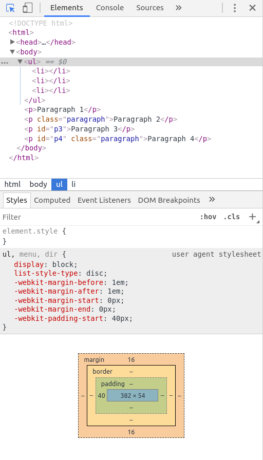

# HTML

## Learning Objectives

- Review the roles of HTML and CSS in web pages
- Identify the parts of an HTML element
- Identify the parts and roles of HTML boiler plate
- Distinguish in-line styles, style tags, and linked style sheets
- Break down the syntax of a CSS declaration and a CSS rule(set)
- List commonly used properties
- Distinguish the components of the box model

## Overview (5 minutes / 0:05)

This lesson will be a refresher on the fundamentals of HTML and CSS. All
material is review from the pre-work, so we will move quickly and potentially
glosses over material. For a much more robust treatment, please see [the Mozilla
Developer Network Learning
Area](https://developer.mozilla.org/en-US/docs/Learn).

### Discussion Questions

- What are the main 3 languages that are used to create a web page?  
- What are their general roles in how a webpage displays information?

## HTML (Hyper Text Markup Language)

HTML exists to solve the problem of how a rich document can be expressed in
plain text. That is to say what are the parts of the document, what role does
each part serve (e.g. heading, image, list, emphasized text, link etc.), and how
do they relate to one another.

HTML expresses the **structure and semantics** of a document in plain text.

[Reference to help you with HTML](./reference/html-tags.pdf)

### Elements: I do (10 minutes / 0:15)


The parts of an HTML document are called **elements** and they are denoted with
**tags**. Tags come at the beginning and end of an element's content.


Extra information about elements can be added using **attributes** which are
added to the opening tag. A ubiquitous element which always needs an attribute
is the `a` (for *anchor*) element. The `a` element creates a link to another
location, frequently another page.

We express the structure of an HTML document by nesting. For example, we can
take a paragraph:

```html
<p>The easiest way to learn HTML is to use it!</p>
```

and we can emphasize part of the text using `em` tags:

```html
<p>The easiest way to learn HTML <em>is to use it!</em></p>
```

We can add a link to the word `HTML` that goes to the MDN HTML page
(https://developer.mozilla.org/en-US/docs/Web/HTML)

```html
<p>
  The easiest way to learn
  <a href="https://developer.mozilla.org/en-US/docs/Web/HTML">HTML</a>
  <em>is to use it!</em>
</p>
```

Notice the use of whitespace (line-breaks and indentation) here. Any amount of
whitespace is understood as a single space to the browser which lets us spread
our content out for readability.

An element can be the child of another element (contained within its parent's
tags) but can never straddle another element.

```html
<!-- Don't do this! -->
<p>The easiest way to learn HTML <em>is to use it!</p></em>
```

Similarly, do not omit closing tags. Every element needs a closing tag (with the
exception of **empty elements** which we'll discuss momentarily).

```html
<!-- Also, don't do this! -->
<p>The easiest way to learn HTML <em>is to use it!</em>
```

Browsers are fairly smart and will guess what you meant - but don't rely on that or you'll have a bad time.

Also, if it guesses wrong it won't tell you! And you'll get really mad at your computer. Bad times.

Because the browser can be uninformatively accommodating, we want to double
check our work with an [HTML validator](https://validator.w3.org/nu/#textarea). Even our
valid example above (with the anchor tag) won't validate just yet as we are
missing some required boiler plate.

### HTML Boilerplate (10 minutes / 0:25)

When a client's browser gets an HTML file from the server, it begins building a
document that will be displayed to the user.

Consider the following HTML boilerplate

```html
<!DOCTYPE html>
<html>
  <head>
    <meta charset="utf-8">
    <title>This is the title</title>
  </head>
  <body>

  </body>
</html>
```

The first line `<!DOCTYPE html>` declares that the document is an HTML document.
This is largely vestigial but necessary and not worth worrying about at the
moment beyond knowing it is necessary.

The next line opens the top level element, `html` which represents the entire
document. This is the only top level element and spans the whole document. The
closing `html` tag should be the last line of the page.

The `html` element has two children, `head` and `body`. Both `head` and `body`
are required and they are the only two valid children of `html`.

#### Head

The `head` element holds **metadata** about the document; metadata meaning extra
information about the document beyond the content of the document.

One required piece of metadata is the `title` element. Every page is required to
have a title; without one the HTML document is invalid. The `title` element
defines what shows up in the browser window, what the page is called when added
to favorites/bookmarks, and what the page is titled in search-engine results.

The `meta` element declares that the *charset* or set of characters used in this
document is **utf-8** which includes most characters from all known human
languages. This is not required but can avoid some problems you might run into
if you use special characters.

Two other meta tags that may autofill into HTML5 boilerplate:

- `<meta name="viewport" content="width=device-width, initial-scale=1.0">` 
  - This sets the width of the area in which the content renders (the viewport)
    to the width of the device and sets the scale to 1. You can read more about
    this
    [here](https://developer.apple.com/library/content/documentation/AppleApplications/Reference/SafariWebContent/UsingtheViewport/UsingtheViewport.html#//apple_ref/doc/uid/TP40006509-SW26).
- `<meta http-equiv="X-UA-Compatible" content="ie=edge">`
  - This is for Internet Explorer to ensure that it uses the highest mode of IE
    available. You can read more about this
    [here](https://msdn.microsoft.com/en-us/library/ff955275?v=vs.85.aspx).

Other examples of metadata include links to external stylesheets (more later)
and scripts to run on the page.

> There are MANY options for the meta tag. So many that there's probably not an exhaustive list anywhere.

#### Body

The `body` element contains the information actually presented to the user; it
represents the content of the document.

### Valid HTML in a file: We Do (15 minutes / 0:40)

Before we start adding content to the body lets create a file locally for our
work so we can open it.

*(Note: All code for this lesson is available in [this
repo](https://github.com/ga-wdi-exercises/html-css-in-class/tree/master) with
branches for each step.)*

Create a directory in your tmp called `html-and-css`

```bash
cd ~/sei/tmp
mkdir html-and-css
cd html-and-css
```

Create a file `index.html` and open it with IntelliJ

```bash
touch index.html
code .
```

Go ahead and type the boilerplate into your index.html file. Then, add p element
to the page body and put a title into the head. (You can use the p element and
title example from above.)

Now, `index.html` should look like this:

```html
<!DOCTYPE html>
<html>
<head>
  <meta charset="utf-8">
  <title>HTML &amp; CSS</title>
</head>
<body>
  <p>
    The easiest way to learn
    <a href="https://developer.mozilla.org/en-US/docs/Web/HTML">HTML</a>
    <em>is to use it!</em>
  </p>
</body>
</html>
```
We can also open this file in the browser by running from the command line:

```bash
open index.html
```

Or for linux machines:
```bash
google-chrome index.html
```

Wow! Super dull! We'll work on making this more lively shortly but first some
practice fixing invalid HTML.

This is valid HTML. We can confirm this by copying and pasting the code into an
[HTML validator](https://validator.w3.org/nu/#textarea).

*(Note: in the title we are using an [HTML
entity](https://developer.mozilla.org/en-US/docs/Glossary/Entity) for the
ampersand.)*

### Exercise: You Do [HTML Fixit](https://git.generalassemb.ly/java-interapt-11-8/html-fix-it) (15 minutes / :55)

- 10 minutes working / 5 minutes review
- Work with a partner and write out plain English answers
- If you finish early, add additional HTML trying to provoke various error
  messages

## Break (10 mins / 1:05)

## More Elements (15 minutes / 1:20)

There are tons of different HTML elements and memorizing them is impractical.
Instead, it is better to start using the 20 percent of the building blocks that
get you 80 percent of the way there. Among these are headings, paragraphs,
lists, and images.

### Headings

The `h1` - `h6` tags are for headings and subheadings. It's rare to use past 3
or 4.

```html
<h1>I'm most important! There should really only be one of me on a page.</h1>
<h2>I'm still quite important! I'm fine being on the page a few times though</h2>
<h3>I'm pretty common!</h3>
<h4>I'm quite detailed</h4>
<h5>I'm probably deep in a menu</h5>
<h6>Wow, that's very detailed</h6>
```

### Paragraphs

The `p` tag is used for paragraphs

```html
<p>Not a ton going on here...</p>
```

### Lists


People love lists. There are two types of HTML lists, ordered and unordered.

```html
<ol>
  <li>I'm first</li>
  <li>I'm second</li>
  <li>I'm third</li>
</ol>
<ul>
  <li>red</li>
  <li>green</li>
  <li>blue</li>
</ul>
```

### Images

If there's anything people like more than lists, it's images.


Images are **empty elements** meaning that they cannot logically have children.
They are represented in HTML with a single, self-closing element.

Some people put a slash at the end of empty elements but it is unnecessary.

```html

<!-- is the same as -->

```

Images require a `src` with a URL for an image.  You should also include an
`alt` tag for screen readers, and when something breaks and the image doesn't
show up.

The url can be any address but generally we want to manage our own assets.

Right click the picture and click **"Save image as..."**, give the file a
shorter name, and make sure you save it to Downloads. I've gone with
`html5logo.png`.


Move the file from your Downloads folder to the `html-and-css` directory.

```bash
mv ~/Downloads/html5logo.png ~/sei/tmp/html-and-css/
```

We tell the browser to request an image and load it into the page by giving an
image tag's source attribute a path to the image.

```html

```

### Semantic HTML

Besides the basic elements, there are some "new" semantic HTML elements that will make your life easier if you learn to use them.

[MDN's Element Reference](https://developer.mozilla.org/en-US/docs/Web/HTML/Element)*

These include elements like:
```html
<section>
<content>
<header>
<footer>
<nav>
<main>

```

[Reference to help you with semantic HTML](./reference/h5d-sectioning-flowchart.pdf)

### Why so many elements?

All of these elements have pre-defined default behavior or styling that the browser will interpret and style for you. You can see some examples of default styles by using the browser styles inspector.



They can all be modified using CSS to look or function in a completely different way. But don't do that! They're here to provide you a sane baseline.

The real reason to use different elements is FOR YOUR OWN SAKE!

Code written in this way is called **semantic HTML**. It makes it easier (for you and everyone else) to read and debug your html. It's way better than trying to debug a sea of nested `<div>` elements.

#### Resources:

```
Good Strategies
===============
Imitation
Repetition
Inspection
Reflection

Good Links
==========
MDN HTML Tutorials (https://developer.mozilla.org/en-US/docs/Learn/HTML)
MDN list of inline HTML elements (https://developer.mozilla.org/en-US/docs/Web/HTML/Inline_elements)
MDN list of block level HTML elements (https://developer.mozilla.org/en-US/docs/Web/HTML/Block-level_elements)
```

- [Solution](https://github.com/ga-wdi-exercises/html-css-in-class/blob/add-content/index.html)

## Wire Framing: I do (5 minutes / 1:25)

It is good practice to sketch up an approximation of what you'd like your end
product to look like. It's alright if it's a rough approximation.


...very rough approximation.

Wireframing is a helpful tool for you to plan out and visualize the layout and
hierarchy of your content before you start coding.


### Build Out Wireframe: You do (10 minutes / 1:35)

- Pick a space on the wall if one is available or use Google Draw and with a group draw out a rough wireframe of a
  homepage of a well known site (Amazon, Facebook, Craigslist, Ebay,
  Reddit, etc)
- 7 minutes working / 3 minutes discussing


