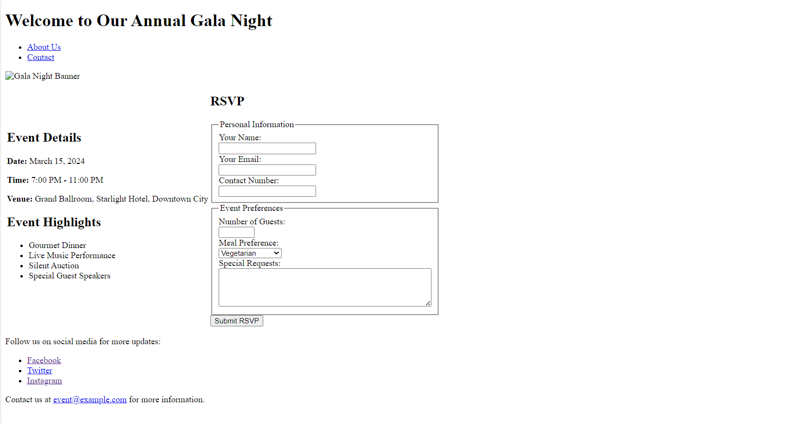

# Event Invitation Page

## Prerequisites

- Familiarity with git

## Instructions

1. cd Inside your day two homework folder 
2. Fulfill the listed requirements.

## Event Invitation Page Creation Instructions

Follow these steps to create an HTML page for your event invitation:

## Step 1: Create a File

- Begin by creating a file named `index.html`. This will be the main document for your event invitation page.

## Step 2: Open Your Project Directory

- Open the current directory in your text editor. For example, if you're using Visual Studio Code, navigate to your directory in the terminal and enter `code .` to open the directory in VS Code.

## Step 3: Set Up Basic HTML Structure

- Inside your `index.html` file, start with the standard HTML5 boilerplate. This includes setting up the document type, the `html` element with a language attribute, the `head` section with meta tags for character set and viewport settings, and a `title` tag for your page's title. Follow this with the `body` tag, where all user-visible content will go.

## Step 4: Add Header and Navigation Links

- In the body, begin with a `header` tag containing a `h1` heading for your event's name. Then, use a `nav` tag to create a navigation menu with links to other pages like "About Us" and "Contact," utilizing `a` tags within an unordered list (`ul`).

## Step 5: Insert an Image Banner

- Add an image banner for your event directly below the header using the `img` tag, specifying the image source (`src`) and an alternative text (`alt`) for accessibility.

## Step 6: Add Event Details

- Create a section using the `section` tag for the event details, including paragraphs (`p`) for the event's date, time, and venue. Use `strong` tags to emphasize key details.

## Step 7: Highlight Event Features

- In another section, list the highlights or features of your event, like "Gourmet Dinner" or "Live Music," using an unordered list (`ul`).

## Step 8: Include an RSVP Form

- Add a form section for RSVPs with the `form` tag, incorporating input fields for personal information and a submit button (`input type="submit"`).

## Step 9: Create a Footer

- Conclude with a footer (`footer` tag) containing contact information, using a `p` tag for an email address formatted as a clickable link with the `a` tag and `mailto:` protocol.

## Step 10: Add Social Media Links

- Optionally, provide links to social media within the footer or another appropriate section using `a` tags, encouraging visitors to follow your event or organization online.

## Step 11: Review and Test Your Page

- After finishing your HTML page, save your work and open the file in a web browser to ensure everything is displayed correctly and all links work as expected. Test the page across different devices and screen sizes for proper display.

## Step 12: Check with HTML validator

- https://validator.w3.org/nu/#textarea
- It should not have no errors or warnings.

## Output

## Hungry for more?! 
- Improve your **git** skills with this hands-on tutorial :point_right: [here](https://gitimmersion.com/index.html)
- Get some more [practice with Github](https://git.generalassemb.ly/java-interapt-11-8/git-github-lab)!
- Even _more_ practice with git with [GitLab](https://lab.github.com/githubtraining/first-day-on-github).

## Troubleshooting
**Oh No I cloned down the original repository!**

> Error: Your changes were rejected because you don't have push access.

No problem! This a chance to learn another useful `git` command!

1. Make sure you fork this repository to your GitHub Enterprise account.
   > Recall that forking creates a copy of a repository that belongs to another
   > user to your own account
2. Copy the clone URL to your clipboard.
3. After you've done that, run the following command inside your `haiku`
   directory. Make sure to replace
   > `git remote set-url origin <paste clone URL here>` Note: Make sure to
   > replace `<paste clone URL here>` with the clone URL on your clipboard. This
   > will set the `remote` named `origin` to point to your forked repository,
   > and not the original.
4. Now when you run `git push origin master`, it will push the changes to your
   forked repository, and not the original (this repo).

## Plagiarism

Take a moment to refamiliarize yourself with the
[Plagiarism policy](https://git.generalassemb.ly/DC-WDI/Administrative/blob/master/plagiarism.md).
Plagiarized work will not be accepted.

## [License](LICENSE)

1.  All content is licensed under a CC­BY­NC­SA 4.0 license.
1.  All software code is licensed under GNU GPLv3. For commercial use or
    alternative licensing, please contact legal@ga.co.

