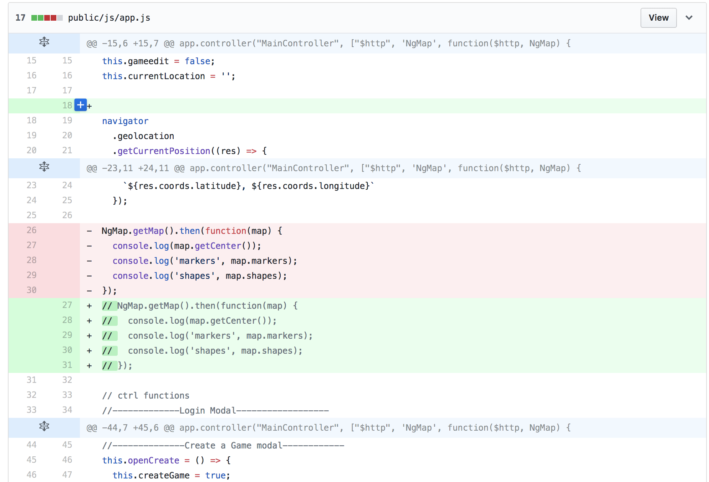

[](https://generalassemb.ly/education/web-development-immersive)

# Version Control with Git and Github

Git is one of a couple tools that you will end up using every day as a
developer; it's an essential component to every developer's work. So what is it?

## Prerequisites

- Familiarity with the command line and terminal

## Objectives

By the end of this, developers should be able to:

- Define version control and identify what problems it solves for developers
- Define a repository (aka repo) and identify the parts of a repo
- Differentiate between a local repository and a remote repository
- Synchronize a local repository with a remote repository using push and pull

## Preparation

1. Go to your git.generalassemb.ly profile
1. In the top right corner, click the `+` and then click `New Repository`
1. Create a new repository called `my_first_repository`
1. Leave all the other inputs as their defaults
1. Click `Create Repository`
1. Give your instructor a thumbs up so they know you're finished

## Introduction

Git is a version control tool: it keeps track of changes across a collection of
files for us. When we use Git, we can see what changes we made and seamlessly
merge them with changes from our coworkers.


## Version Control

Simply put, version control is a way of tracking _changes_ made to a file or
group of files over time.

Git is a version control system. There are others, like Mercurial and SVN, but
Git is the most popular and the most powerful. Git will track changes made to a
group of files in a directory. Git users like ourselves can **commit** or save
our changes and have access to a history of all the saves or **commits** that we
have made.

### Think, Pair, Share

> 5 min exercise, 5 min review

In breakout rooms with groups or 2 or 3 discuss the questions below. After 5 minutes,
we'll go over responses as a class.

- Why might we want to have different versions of a file?
- What strategies have you used to keep track of changes you've made to a
  document or file before? If you haven't, brainstorm ways you might keep track
  of different versions of a file/document.
- How well did that strategy work? Was it painful? Can you see any limitations
  or problems associated with that strategy?
- How might that approach work in a team environment?

### Follow Up

If you've worked with track changes in Microsoft Word, then you're familiar with
part of what Git does. Track changes will track any changes (inserted text,
deleted text, etc) to a document. Git can show _differences_ between the current
version and the previous version in something called a `diff` (command:
`git diff`). A `diff` will show what has been added in green text or
highlighting, while displaying the things removed in red.



Git does this and a lot more though!

For example, if you and your coworker are writing a memo in Microsoft Word and
using track changes, how do you keep track of which version is the final version
(yours or your coworker's)?

Here's a short list of things you can do with Git:

- track changes to a set of files over time (version control)
- save your work with descriptive save messages (commits)
- track multiple versions and histories of the same codebase (branching)
- merge branches together to combine multiple developer's efforts

## How To Work with Git

The basics of working with Git could be somewhat familiar to you. Git works
inside of a **repository**: a folder where Git is watching and tracking changes
to files. We can turn a directory into a repository by running `git init`.

When we want to record or **commit** some changes we've made and 'save our
progress so far, we do so by **staging** those changes (with `git add`) and then
**committing** them (with `git commit`).

If we want to see the current state of our repository, like what files have been
changed and may need to be committed, we can do so by checking the repository's
status (with `git status`).

| Command      | Description                                                     |
| ------------ | --------------------------------------------------------------- |
| `git init`   | Initialize a repository; turn a directory into a git repo       |
| `git status` | check the state of our repository                               |
| `git add`    | _stage_ changes to be committed                                 |
| `git commit` | save changes to the repo's history (i.e. make them 'permanent') |

## I Do: Working with Git

Watch me do the following:

1. Navigate to my `tmp` directory and create a new directory called
   `my_first_repository`
1. Turn this directory into a git repo with `git init`
1. Create a file in the repository called `index.html`
1. See the current state of the repository with `git status`
1. Stage the new file I created with `git add`
1. Check the new status of the repository
1. Commit my changes to the repository with `git commit`
1. Check the new status of the repository

### Bonus! 🎉

How can we see the history of a repository? By viewing the log!

```sh
git log
```

Press `q` to exit the logs.

## You Do: Working with Git

Now it's your turn! Work through the following steps:

1. Navigate to your `tmp` directory and create a new directory called
   `my_first_repository`
1. Turn this directory into a git repo. What was the command to do that?
1. Create a file in the repository called `index.html`
1. See the current state of the repository. What command does that?
1. Stage the new file you created. What was the command to do that?
1. Check the new status of the repository. What was the command to do that?
1. Commit your changes to the repository. What was the command to do that?
1. Check the new status of the repository. What was the command to do that?

## Review: What did we just do

### Creating a New Repo

**Command:** `git init`

The command for creating a new repo is `git init` (to _initialize_ a new repo.
This command creates a `.git` directory where Git will track and manages all the
changes to the files in this directory.

You want to be careful where you run `git init`. You only want to run that
command in a folder where you want to create a new repository. If you
accidentally run it somewhere else, you can delete the repository by removing
the `.git` directory (using `rm -rf`).

### Saving Our Work

**Commands:** `git add`, `git commit`

Saving our work in Git requires two steps: Adding changes to the **staging
area** (`git add path/to/filename.js`) and then **committing**
(`git commit -m "description of changes"`) those changes.

The **staging area** is one of Git's more unique features, and it can take some
time to wrap your head around it. It helps to think of the **staging area** as a
buffer between the working directory and the project history.

> [Why stage files?](http://gitolite.com/uses-of-index.html)

Instead of automatically committing all of the changes you've made since the
last commit, the **staging area** lets you group _related changes_ into highly
focused snapshots before actually committing to the project history. This means
you can make all sorts of edits to unrelated files, then go back and split them
up into logical commits by adding related changes to the stage and commit them
piece-by-piece

Here's another way to think about it...


## You Do: AMRAP

Go through the following steps as many times as you can in the time provided!

1. Modify the file(s) in your repository. Try creating new files and modifying
   existing files.
2. Stage your changes. Try it with `git add .`, `git add -A`, and
   `git add ./path/to/file.js` (where `./path/to/file.js` is a path to a file in
   your repository)
3. Commit your changes.

Periodically check the status of your repository and after each commit check
your repository's log.

## Pause and Reflect

> The instructor will post a link to this heading in Slack. Respond with an
> emoji that best describes you're comfort level with what we've covered so far.
> Respond in a thread with any questions you have!

## Working with GitHub

First, we should clarify: GitHub **did not** create git. Git was created by
Linus Torvald (the same guy who created Linux) and is an open source project.
GitHub is a Software-as-a-Service product built around git.

Developers use GitHub for everything (which is why we use it for everything).

To work with GitHub, we'll need the following commands:

| Command      | Description                                    |
| ------------ | ---------------------------------------------- |
| `git remote` | adds a remote repository to a local repository |
| `git push`   | pushes local changes to the remote repository  |
| `git pull`   | pulls changes from a remote repository         |

## I Do: Working with GitHub

Watch me work through the following:

1. I'm going to add my remote repository on GitHub to my local repository with
   `git remote add origin <ssh_url_to_github_repo>`
1. I'm going to push changes to my remote with `git push -u origin master`
1. I'm going to visit my repo on GitHub to see if my changes made it 🤞
1. I'm going to make a change to my repository, stage and commit that change,
   and then push it, this time with `git push`

## You Do: Working with GitHub

Now it's your turn! Work through the following steps:

1. Add your remote repository on GitHub to your local repository. What was the
   command for that? Use the repository on GitHub you created at the beginning
   of class.
2. Push your changes to your remote. What was the command for that?
3. Visit your repo on GitHub to see if the changes made it 🤞
4. Make a change to your local repository, stage and commit that change, and
   then push it. What was the command for that? Is it the same as the previous
   command you used to push changes?

## Review: What did we just do

### Adding a remote

**Command:** `git remote`

When you want to manage the remote repository for a local repository, you use
the `git remote` command. This command has a lot of subcommands to it, including
`add`, which we used to add our GitHub repo as the remote to our local repo:

```sh
git remote add origin <ssh_url_to_github_repo>
```

In the above command, `origin` is a name that we're giving this remote. We can
call it whatever we want, but the convention is to call it `origin`.

### Pushing Changes

**Command:** `git push`

When we have commits locally that we want to back up and "publish", we use
`git push`. The first time we ran this command, we used
`git push -u origin master`. The `-u` part sets `origin master` as the default.
So, for now on we can just run `git push` and git will push to `origin master`.

When we push to a remote, we want to specify:

1. Which remote are we pushing to (it's common to have more than one!)
1. Which branch are we pushing to

We're going to talk about branches more in another lesson. For now, you'll only
have one branch: the `master` or `main` branch. We'll also only have one remote for now.
But we'll still need to tell Git what remote and branch we want to push to, so
we have to run `git push origin master` or set `origin master` as the default.

## Additional Resources

- [Become a Git Guru](https://www.atlassian.com/git/tutorials)
- [What makes a great commit message?](http://tbaggery.com/2008/04/19/a-note-about-git-commit-messages.html)
- [Interactive Git Cheetsheet](http://ndpsoftware.com/git-cheatsheet.html)
- [Github Guides](https://guides.github.com)
- [Github Training](https://training.github.com/kit/)
- [Git Immersion - Interactive Course](http://gitimmersion.com/lab_05.html)
- [Pro Git](http://git-scm.com/book/en/v2) - An in-depth free PDF book for those
  wanting to understand git deeper
- [GitUp - Interactive Commit Visualizer](http://gitup.co)
- [Practice with Git](https://github.com/grayghostvisuals/practice-git)

## [License](LICENSE)

1. All content is licensed under a CC­BY­NC­SA 4.0 license.
1. All software code is licensed under GNU GPLv3. For commercial use or
   alternative licensing, please contact legal@ga.co.
