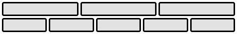
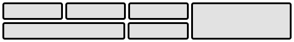

[](https://generalassemb.ly/education/web-development-immersive)

# Flexbox & Grid

Now that we have the basics of HTML and CSS down, it's time to start exploring
some of the more advanced aspects of CSS. For a long time, using CSS to layout
HTML elements was a really challenging task, involving a lot of `float`s with
margins and padding. We're going to use Flexbox and CSS Grid, which make this
easier!

## Objectives

By the end of this, developers should be able to:

- Explain what Flexbox is and what problem it solves
- Use Flexbox to layout HTML elements
- Explain what CSS Grid is and what problem it solves
- Use CSS Grid to create a page layout.
- Explain when to use Flexbox versus CSS Grid

## Introduction

HTML was created as a document-oriented markup language. CSS emerged as a way to
style the elements of documents without interfering with the semantic meaning of
them. In many ways it achieves this goal well; yet it remains one of the most
frustrating parts of web development:


Aligning items with CSS has traditionally been one of the key contributors to
this aggravation. For a long time, there wasn't a good way to layout elements
using CSS despite alignment being an increasingly important part of web design.

Today we'll be learning about two modern tools for aligning content on the web.

**Flexbox**, a layout mode introduced with CSS3, is great for layout out
elements in common UI elements. It is at this point widely implemented across
different browsers.

**CSS Grid**, an even newer layout mode, is well suited for laying out the key
components of a webpage. It is not as widely implemented as Flexbox, but it does
work on most modern browsers.

> We can check https://caniuse.com/ to see what browsers support what we want to
> implement.

## Problem 1: Vertical Alignment (15 min / 0:20)

Let's start out by talking about a problem that anybody who has written CSS has
likely dealt with:

**I have a `div`. I would like to center it vertically and horizontally on my
page.** The end result should look something like this:


Example on [Codepen](http://codepen.io/awhitley1233/pen/ygJzJW)

### You Do: Center a `div`

Take about **10 minutes** to try to get the div in this example centered like
the image above. Make sure it's still centered vertically and horizontally when
you change the screen size.

#### You Tell Me: What Should I Try

```html
<html>
  <body>
    <div>Div 1</div>
  </body>
</html>
```

```css
body {
  min-height: 100vh;
  margin: 0 auto;
}

div {
  width: 100px;
  height: 100px;
  background: #990012;
  color: #ffffff;
  border-radius: 10px;
  font: 14pt Comic Sans MS;
  text-align: center;
  line-height: 100px;
}
```

<details>

<summary><strong>These might work:</strong></summary>

> **Padding**: The simplest approach would be to set equal padding on the top
> and bottom of the container (body) element. We would need to know the exact
> height of the element and container in order to get this exactly right. This
> can also get tedious when there is more than one element in a container.

> **Margin**: Similarly, we could add some margin to the element we are trying
> to center. The same issues remain.

> **Absolute Positioning**: You could use properties like `top` and `left` to
> position an element in the center. This, however, removes it from the document
> flow.

</details>

<details>

<summary><strong>These could work in other scenarios:</strong></summary>

> **`line-height`**: When vertically centering a single line of text, you can
> set the line-height to that of the whole container.

> **`vertical-align`**: Used to align words within a line of text (e.g.,
> superscript, subscript).

</details>

The tough part is that how to vertically center a element depends on its context
meaning that an element has to look to its parent and then align itself;
siblings start to make this very difficult (go figure!). Depending on your
situation, one or more of the above techniques could work.
[Here's an enlightening post on the matter](https://css-tricks.com/centering-in-the-unknown/).

#### Flexbox to the Rescue

Laying out elements used to be difficult and fraught with error. Now, we can
just use Flexbox:

```css
body {
  min-height: 100vh;
  margin: 0 auto;
  display: flex;
  justify-content: center;
  align-items: center;
}
```

View solution [here](http://codepen.io/awhitley1233/pen/EZyvMY)

## How It Works (10 min / 0:30)


When you declare `display: flex;` in a CSS rule, whatever element is targeted by
that rule becomes a **flex container**.

That means that all of the flex container's **immediate** children can have flex
properties applied to them.

The flexbox approach differs from the methods described in the CodePen above in
that the arrangement of elements is managed by the **parent** container. The
child of a **flex container** is called a **flex item**. We can change the way
flex items display by setting item-specific properties that will come later in
the lesson.

After the `display` property, the most important flexbox property to understand
is `flex-direction`. It is very important to remember that the `flex-direction`
orients **flex container's main-axis**. The main axis can be set to run
vertically or horizontally depending on the value of `flex-direction`. All other
flex-related properties are defined in terms of the main axis.

First, use `flex-direction` to indicate whether you want the flex items in the
container to "read" left-to-right (`row`), right-to-left (`row-reverse`),
top-to-bottom (`column`), or bottom-to-top (`column-reverse`).

| flex-direction | main-axis Direction |
| -------------- | ------------------- |
| row (default)  | left-to-right       |
| column         | top-to-bottom       |
| row-reverse    | right-to-left       |
| column-reverse | bottom-to-top       |

The `justify-content` property aligns content relative to the **main axis**.
Possible values are: `flex-start` (default), `flex-end`, `center`,
`space-between`, and `space-around`.

> What do you think each does; does the flex-direction affect this?

The `align-items` property is similar to `justify-content` but aligns relative
to the **cross-axis**. There are similar options here: `flex-start`, `flex-end`,
`center`, `stretch` (default), and `baseline` (items are aligned by their
baselines / where the text is).

By default, a **flex container** will arrange its children in a single row or
column. The `flex-wrap` property can modify this with the values `nowrap`
(default), `wrap`, and `wrap-reverse`.

When text is wrapping, `align-content` controls how the rows or columns are
arranged relative to the cross-axis: `flex-start`, `flex-end`, `stretch`
(default), `center`, `space-between`, and `space-around`.

### In Summary

| Property                                                                                | What's It Do?                           | Examples                  |
| --------------------------------------------------------------------------------------- | --------------------------------------- | ------------------------- |
| **display**                                                                             |                                         | `flex`                    |
| **[flex-direction](https://developer.mozilla.org/en-US/docs/Web/CSS/flex-direction)**   | Sets the directional flow of flex items | `row`, `column`           |
| **[justify-content](https://developer.mozilla.org/en-US/docs/Web/CSS/justify-content)** | Align along main axis                   | `center`, `space-between` |
| **[align-items](https://developer.mozilla.org/en-US/docs/Web/CSS/align-items)**         | Align along cross-axis                  | `flex-start`, `center`    |

> That's a lot of CSS properties! Don't worry, you're not expected to memorize
> all of them. Being a developer is less about knowing everything off the top of
> your head and more about knowing best practices and where to find more info
> [Here's a great resource](https://css-tricks.com/snippets/css/a-guide-to-flexbox/).

### You Do: Explore Flexbox Properties

[Open this Codepen](https://codepen.io/ZakkMann/pen/OZBpob) to explore the
different Flexbox properties and see how they work.

## Problem 2: Make the Footer Stick (10 min / 0:40)

I want my footer to lie along the bottom of my page. Once I've accomplished
that, I want to evenly distribute the content boxes horizontally inside of the
`<main>` element.


[Example on CodePen](http://codepen.io/awhitley1233/pen/ygJzqy)

### You Tell Me: What Should I Try (Again)

```html
<html>
  <header>FlexBox</header>
  <main>
    <section>Content 1</section>
    <section>Content 2</section>
    <section>Content 3</section>
  </main>
  <footer>CodePen by General Assembly</footer>
</html>
```

```css
body {
  min-height: 100vh;
  margin: 0 auto;
  font: 12pt Comic Sans MS;
}

header,
footer {
  width: 100%;
  height: 30px;
  background: #000000;
  color: #ffffff;
  text-align: center;
  line-height: 30px;
}

main {
  background: #d3d3d3;
}

section {
  width: 100px;
  background: #990012;
  color: #ffffff;
  border-radius: 10px;
  margin: 5px;
  text-align: center;
  line-height: 100px;
}
```

Making the footer lie against the bottom of the screen is pretty easy: just use
absolute or fixed positioning. However, using absolute or fixed positioning
means everything else on the page ignores my footer. The text of `<main>` could
easily run under the footer. We want the text to "push" the footer to the end of
the page.

### Flexbox to the Rescue Again

```css
body {
  min-height: 100vh;
  margin: 0 auto;
  font: 12pt Comic Sans MS;
  display: flex;
  flex-direction: column;
  justify-content: space-between;
}
```

<details>

<summary><strong>How is main axis of the `body` oriented here? What about the cross-axis?</strong></summary>

> Main: vertically, Cross: horizontally

</details>

Now let's horizontally distribute the `<section>` elements containing the page's
content inside of the `<main>`. What element should we style?

```css
main {
  background: #d3d3d3;
  display: flex;
  justify-content: space-around;
}
```

Now we have two **flex containers**: `main` and `body`. By setting
`display: flex` on main we can tell the three `section` elements to be
controlled as flex items.

[Solution on CodePen](http://codepen.io/awhitley1233/pen/PWzOPg)

<!--
## You Do: More Flexbox Properties (25 minutes / 1:05)

> 15 min research, 10 min presentations

Time for you to research some more Flexbox properties. You will be split into
groups and assigned one of the following flex properties:

- `flex-wrap`
- `flex-grow`
- `order`
- `align-content`

Your task is to:

- Come up with [ELI5 ("Explain Like I'm 5")](https://dev.to/t/explainlikeimfive)
  definition for the property (and maybe write one!).
- Create [a Codepen](http://codepen.io) demonstrating the property's usage, then
  post it in the `#sei29-discussion` Slack channel.
- If possible, practice using some of the flex properties we covered in the
  previous section.

> You will need to [create a free Codepen
> account](https://codepen.io/accounts/signup) in order to save your pen and
> share the link.

If you finish early, try exploring some of the [other flexbox
properties](https://css-tricks.com/snippets/css/a-guide-to-flexbox/) not
assigned in this exercise.


### Some Helpful Resources

- [CSS Tricks' Guide to
  Flexbox](https://css-tricks.com/snippets/css/a-guide-to-flexbox/)
- [A Visual Guide to CSS Flexbox
  Properties](https://scotch.io/tutorials/a-visual-guide-to-css3-flexbox-properties)
- [Solved by Flexbox](http://philipwalton.github.io/solved-by-flexbox/)
- [Flexplorer](http://bennettfeely.com/flexplorer/)

### Recap

<details>

<summary><strong><code>align-content</code></strong></summary>

> How multiple rows or columns are spaced along the cross-axis. Takes the same
>properties as justify-content.
>
>[Example](https://codepen.io/perryf/pen/RQNYPM)

</details>

<details>

<summary><strong><code>flex-grow</code></strong></summary>

> If the flex container is too big for all the flex items, flex-grow specifies
>the relative proportion a particular flex item will occupy
>
>[Example](https://codepen.io/perryf/pen/aqzaRV)

</details>

<details>

<summary><strong><code>flex-wrap</code></strong></summary>

> Defines flex item behavior if they expand beyond a single line.
>
>[Example](https://codepen.io/perryf/pen/vdEzMv)

</details>

<details>

<summary><strong><code>order</code></strong></summary>

> Specifies the order in which you want flex items to appear along the main
> axis. The default is 0. Negative numbers are allowed.

</details>

<details>

<summary><strong><code>flex-basis</code></strong></summary>

> Specifies how big the flex items "want" to be, or the initial size of a flex
>item
>
>[Example](http://gedd.ski/post/the-difference-between-width-and-flex-basis/)

</details>
-->

## Break (10 min / 1:15)

## The Holy Grail Layout (5 min / 1:20)


This is something you know well, even if you don't recognize the term. It
describes a webpage with a header, footer, and three columns: a wide "main"
column, a navigation column on the left, and an advertisement, site map, or
extra info column along the right.

Obviously, this layout won't work on tiny screens, unless you really like
super-skinny columns. It's common to stack things on top of each other for
mobile views to make one single column.

Before flexbox, this involved a lot of pushing and shoving with dimensions and
positioning. You would essentially have to write two completely separate
stylesheets (one for mobile, and one for desktop), each to control the different
layours.

With flexbox, just change the `flex-direction` for smaller screen sizes, make
any size / order adjustments on the sections of the page, and you're pretty much
done!

```css
@media screen and (max-width: 600px) {
  main {
    flex-direction: column;
  }

  section {
    order: 1;
  }
}
```

> A layout so holy,
> [it has its own Wikipedia article](<https://en.wikipedia.org/wiki/Holy_Grail_(web_design)>).

[Example](http://codepen.io/awhitley1233/pen/XpKzqV)

## CSS Grid

### What is CSS-Grid Layout? (10 min / 1:30)

From the [www.w3.org](https://www.w3.org/TR/css-grid-1/) website:

> "Grid Layout is a new layout model for CSS that has powerful abilities to
> control the sizing and positioning of boxes and their contents. Unlike
> Flexible Box Layout, which is single-axis–oriented, Grid Layout is optimized
> for 2-dimensional layouts: those in which alignment of content is desired in
> both dimensions."

With Grid layout, you can divide up the screen into `rows` and `columns` of
sizes of your choosing, and then specify how many rows and columns each `cell`
takes up. Sizing can be fixed, or dynamic, allowing you to create modern
looking, versatile websites.

_Example of **flexbox** layout_



_example of **grid** layout_



> Notice that the grid items are aligned (rather than filling up the available
> space) and that cells can take up multiple rows or columns

## You Do: Explore the source code (5 min / 1:35)

Let's take a few minutes to
[explore this web app](https://www.inprnt.com/discover/) built with Grid layout.

> This site was built by a former GA student using CSS Grid, Flexbox, and React.

There are a few ways to implement css grid. I'll show you the steps of how I
like to do it.

Feel free to code along in codepen.

1. To start, you must have a _container_ (or _parent_) element, with at least
   one _nested_ (or _child_) elements inside.

```html
<div class="parent">
  <div class="child child-one">1</div>
  <div class="child child-two">2</div>
  <div class="child child-three">3</div>
</div>
```

2. On the container, specify that you are using `display: grid` and what your
   **_template_** will look like - more specifically, your **_rows_** and
   **_columns_**. Here's an example.

```css
.parent {
  display: grid;
  grid-template-rows: 100px 200px 300px;
  grid-template-columns: 100px 1fr 2fr 100px;
}
```

`fr` represents `fraction`, it's a unit that will evenly span the remainder of
the space.

Here we have specified **_3 rows_**, taking up 100, 200, and 300 pixels
respectively. We also specified **_4 columns_**, giving us a total of **_12
cells_**. `grid-template` also takes other units like `%`, `rem`, and `auto`.
For now we will focus on `px` and `fr` units. You can also use `repeat` to
specify multiple rows or columns of one size like this `repeat(5, 1fr)`

3. the _child_ elements, you can specify _where_ the _cells_ are located and the
   _size_ you want them to be. I like to follow this pattern:

```css
selector {
  grid-row: where-to-start / span size;
}
```

> same would work for `grid-column`

So something like this on a _child_ element:

```css
.child-one {
  grid-row: 1 / span 1;
  grid-column: 1 / span 2;
}
```

This element takes up 1 row, starting at row 1, and takes up 2 columns, starting
at column 1.

We could also write `grid-row: 1;` for short, if your element only spans 1 row.

### You do: Griddle me this (10 min / 1:45)

Now let's follow along and try to make our _holy grail_ website design using
Grid layout. We will need a header, a footer, two side columns, and a main
section. The starter code has been set up for you
[here](https://codepen.io/perryf/pen/rJNZpw)

Using the grid concepts we just learned, see if you can spend a few minutes
getting the holy grail layout built.

> Try it! Don't read ahead! We'll go over it next.

### We do: Griddle me this (10 min / 1:55)

Now let's add our `grid-template` code to our parent element.

```css
body {
  display: grid;
  grid-template-rows: 80px 1fr 80px;
  grid-template-columns: 100px 1fr 100px;
}
```

Now let's figure out how to format our `header`. We want the header to take up 1
row and 3 columns. Let's give it some color too.

```css
header {
  grid-row: 1;
  grid-column: 1 / span 3;
  background: steelblue;
}
```

Now onto our left column. That will only take up 1 column and one row, starting
at row 2.

```css
.left {
  grid-row: 2;
  grid-column: 1;
  background: lightseagreen;
}
```

The right column can be positioned in a very similar fashion.

```css
.right {
  grid-row: 2;
  grid-column: 3;
  background: mistyrose;
}
```

The main section is the largest section (except on tiny screens) but really only
takes up one row and one column.

```css
main {
  grid-row: 2;
  grid-column: 2;
  background: lemonchiffon;
}
```

Lastly, our footer will take up the entire bottom row, spanning 3 columns.

```css
footer {
  grid-row: 3;
  grid-column: 1 / span 3;
  background: rebeccapurple;
}
```

Solution on [codepen](https://codepen.io/perryf/pen/eVYbGv)

## You Do: [CSS Grid Art](https://git.generalassemb.ly/java-interapt-11-8/css-grid-art) (20 min / 2:15)

Check out the link and work through it for the next 20 minutes.

## Closing / Questions (Rest of Class / 2:30)

You don't have to pick between flexbox and grid. You can use both on the same
page, in different elements.

You can even use one inside of the other! A common practice is to use Grid for
the page layout, and flexbox for smaller page components.

- Why is alignment so important with modern web development?
- What problems do flexbox and css grid solve?
- Where do I put `display: flex` or `display: grid`?
- With flexbox, what are some properties that `justify-content` can take?
- Explain how to place an item into a grid container.

## Additional Practice

- [Flexbox Froggy](http://flexboxfroggy.com/) (10 min / 3:55)
- [CSS Grid Garden](http://cssgridgarden.com/)
- [Hyrule Potion Shop](https://git.generalassemb.ly/ga-wdi-exercises/hyrule_potion_shop)
  (10 min / 4:10)

## Resources

- [flexbox.io](https://flexbox.io/)
- [The Ultimate Flexbox Cheatsheet](http://www.sketchingwithcss.com/samplechapter/cheatsheet.html)
- [CSS Tricks Guide to Flexbox](https://css-tricks.com/snippets/css/a-guide-to-flexbox/)
- [A Visual Guide to CSS3 Flexbox Properties](https://scotch.io/tutorials/a-visual-guide-to-css3-flexbox-properties)
- [Solved by Flexbox](http://philipwalton.github.io/solved-by-flexbox/)
- [Flexplorer](http://bennettfeely.com/flexplorer/)
- [Holy Grail Layout - Solved By Flexbox](https://philipwalton.github.io/solved-by-flexbox/demos/holy-grail/)
- [The CSS `grid` Module](https://css-tricks.com/snippets/css/complete-guide-grid/)
- [Wes Bos Teaches CSS-Grid](http://wesbos.com/announcing-my-css-grid-course/)
- [Learn CSS Grid](http://learncssgrid.com/)

## [License](LICENSE)

1. All content is licensed under a CC­BY­NC­SA 4.0 license.
1. All software code is licensed under GNU GPLv3. For commercial use or
   alternative licensing, please contact legal@ga.co.
